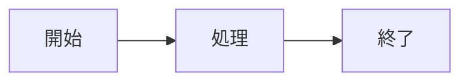

# 本文の書き方

プレビューと PDF の両方で同じ規則で解釈される記法を説明します。

本製品のドキュメント形式は **Ohyna Markdown** です。Markdown を基礎とした製品プロファイルで、使える記法は本章と仕様書に従います。表やタスクリストなど、広く使われる記法の一部も利用できます。

コードの色分け・数式・図は製品が定めた経路で処理します（数式は KaTeX 0.16.22、図は Mermaid.js メジャー 11）。キーボードキー表記（`<kbd>`）や検査の条件は、本章および「確認と PDF 出力」を参照してください。

---

## 1. インラインの装飾

| 要素 | 書き方 |
|------|--------|
| 斜体 | `*文字列*` または `_文字列_` |
| 太字 | `**文字列**` |
| 太字かつ斜体 | `***文字列***` |
| 打消し線 | `~~文字列~~` |
| ハイライト | `==文字列==` |
| 下線（挿入） | `^^文字列^^` |
| インラインコード | バッククォート 1 つで囲む |
| キーボードキー | `<kbd>Ctrl</kbd>` |
| 自動リンク | `<https://example.com>` |
| 強制改行 | 行末に半角スペースを 2 つ置く |

キーボードキーは挿入メニューの「キー（kbd）」でも囲めます。プレビューと PDF ではキーらしい体裁で表示されます。

---

## 2. 見出し

```markdown
# 第1水準
## 第2水準
### 第3水準
```

`#` の直後には空白が必要です。見出し本文が空だと検査エラーになります。第 6 水準まで使えます。

---

## 3. 段落・引用・水平線

```markdown
段落の本文です。空行で段落を分けます。

> 引用です。

---
```

---

## 4. リスト

```markdown
- 箇条書き
  - 入れ子

1. 番号付き
2. 続き

- [ ] 未完了のタスク
- [x] 完了したタスク
```

プレビュー上でタスクのチェックを切り替えることはできません（見た目固定のため）。完了／未完了は Markdown 上の `[x]` / `[ ]` で表します。

---

## 5. リンクと画像

```markdown
[表示名](https://example.com "タイトル")

```

| 経路 | 相対パスのローカル画像 |
|------|------------------------|
| 本画面から PDF 化 | 相対パスのローカルファイルは埋め込みません。`https:` / `http:` / `data:` の画像は利用できます |

リンク先が空、画像パスが空の場合は検査エラーになります。

---

## 6. 表

```markdown
| 左寄せ | 中央揃え | 右寄せ |
|:-------|:--------:|-------:|
| a      | b        | c      |
```

セル内では強調やインラインコードも使えます。

---

## 7. コードとシンタックスハイライト

### 7.1 フェンス付きコード

言語名を付けたコードブロックは、成果物で色分けされます（エンジンは Pygments）。

````markdown
```python
def greet(name: str) -> str:
    return f"hello, {name}"
```
````

検査では、指定した言語名を Pygments が解釈できるか確認します。解釈できない名前はエラーです。言語名を省略したブロックはプレーンなコードとして出ます。

よく使う言語名の例:

| 指定 | 内容 |
|------|------|
| `python` / `py` | Python |
| `javascript` / `js` / `mjs` / `cjs` | JavaScript |
| `typescript` / `ts` | TypeScript |
| `php` | PHP |
| `json` | JSON（内容の構文も検査） |
| `yaml` / `yml` | YAML（内容の構文も検査） |
| `bash` / `sh` / `shell` / `zsh` | シェル |
| `powershell` / `ps1` / `pwsh` | PowerShell |
| `html` / `css` / `sql` / `go` / `rust` / `java` / `csharp` / `c` / `cpp` / `ruby` など | 各言語 |
| `text` / `txt` / `plain` | プレーンテキスト |
| `console` | コンソール出力向け |

上記以外でも、Pygments が認識する名前（または製品エイリアス）であれば成果物で使えます。

### 7.2 図・数式・Mermaid コード用のフェンス

| 書き方 | 処理 |
|--------|------|
| `` ```mermaid `` | 図として描画（本章「Mermaid ダイアグラム」） |
| `` ```mermaid code `` | Mermaid の色分け付き**コード**（図にしない） |
| `` ```math `` 等 | ディスプレイ数式（本章「数式」）。編集画面でも TeX 色分け |

### 7.3 編集画面の色分け

| 対象 | 編集画面 | プレビュー／PDF |
|------|----------|-----------------|
| 見出し・強調・打消し・リンク・リスト・引用 | 色分けあり | 組版結果 |
| `==ハイライト==` / `^^挿入^^` | 色分けあり | 成果物の mark／下線 |
| `$…$` / `$$…$$` / `\(...\)` / `\[…\]` | 数式用色分け | KaTeX 描画 |
| 数式フェンス（`math` 等） | TeX 色分け | KaTeX 描画 |
| `` ```mermaid `` / `` ```mermaid code `` | Mermaid 色分け | 図／コード HTML |
| 上記のよく使う言語フェンス | 対応言語で色分け | Pygments |
| 言語名なしのフェンス | プレーン | プレーン |
| Pygments のみの稀な言語 | プレーンのことがある | Pygments で色分け |

最終的な見た目はプレビューと PDF（Pygments／KaTeX／Mermaid）で確認してください。

---

## 8. 数式（KaTeX）

| 種類 | 書き方 |
|------|--------|
| インライン | `$E = mc^2$` または `\(E = mc^2\)` |
| ディスプレイ | `$$ ... $$` または `\[ ... \]` |
| フェンス | 言語名 `math`（または `latex` / `katex` / `tex` / `stex`）のコードフェンス |

コードブロックの中の `$` は数式にしません。数式が解釈できない場合は検査エラーになります。

---

## 9. Mermaid ダイアグラムとコード

### 9.1 図として描画

フェンスを **`mermaid` ちょうど**にします（追加の語は付けません。開き記号はバッククォートです）。

````markdown

````

プレビューではブラウザ上で、PDF ではサーバ上で、いずれも公式の Mermaid.js により描画します。図の描画に失敗した箇所は赤い枠で示され、通知も出ます。

### 9.2 コードとして掲載（色分けあり）

ソースを図にせず、Mermaid として色分けしたコードブロックにするときは **`mermaid code`** と書きます。

````markdown

````

意図的に壊した例を載せるときは `text` を使います。`mermaid` にそれ以外の語を付けると検査エラーになります。

---

## 10. 折りたたみ

```markdown
??? note "補足"
    ここに補足事項を記載します。
```

プレビューと PDF では **常に展開**して表示します。プレビュー上で開閉できません（PDF と同じ見た目を保つためです）。

---

## 11. 脚注

```markdown
本文に注釈を付します[^1]。

[^1]: 注釈の内容です。
```

---

## 12. その他

| 機能 | 書き方の例 |
|------|------------|
| 定義リスト | 用語の次の行に `: 説明` |
| 略語 | `*[HTML]: HyperText Markup Language` |
| 注意書き（アドモニション） | `!!! note "タイトル"` のあとインデントした本文 |
| 目次 | `[TOC]`（前後改ページ。リーダーとページ番号付き） |

本文中に直接書ける HTML は、安全のため許可されたタグ・属性に限られます。代表例は `a`、`img`、`table` 系、`kbd`、`details` / `summary`、見出し、リストなどです。スクリプトなど危険な要素は除去されます。

---

## 13. 初期サンプル

**初めて**アプリを開いたときだけ、上記の記法・コード・数式・図の例を含むサンプルが表示されます。2 回目以降は、前回開いた／保存したファイル（または空の新規）から始まります。

いつでもファイルメニューの「サンプルから作成」で同じサンプルを新規ドキュメントとして開けます。「空のドキュメント」は必須設定入りの無題（タイトル「無題」）から始めます。

サンプルを書き換えて使い始めて構いません。編集後は「保存」でファイルへ書き込んでください。
