---
ohyna:
  cover: true
  title: Ohyna 記法サンプル
  subtitle: Ohyna Markdown の記法と設定の確認用
  label: SAMPLE
  meta:
    - Ohyna 1.0
    - 記法サンプル
  style: blue
  lang: ja
  rounded: true
  radius: md
  font: noto
  fontSize: 10.5pt
  lineHeight: 1.7
  coverPattern: noise
  coverGradient: true
  headingBand: true
  tableHeaderFill: true
---

# Ohyna 記法サンプル

**Ohyna Markdown** で利用できる記法、コードの色分け、数式、Mermaid 図、および文書形式の考え方を確認するためのサンプルです。表紙と体裁は「ドキュメント設定」から変更できます。

> 体裁の確認と記法の参照用です。詳細は画面「ヘルプ」の「仕様書」を参照してください。`[TOC]` の前後では改ページされます。

[TOC]

---

## 0. 製品形式と準拠の考え方

### 0.1 Ohyna Markdown とは

Ohyna が扱う入力は、製品が定義する文書形式 **Ohyna Markdown** です。

| 区分 | 意味 |
|------|------|
| **製品契約** | 利用者が従う入力・意味・検査（本製品の仕様） |
| **制限付き採用** | 外部エンジン（Mermaid／KaTeX など）が解釈する範囲を、製品が受理する部分集合として固定 |
| **参照実装** | いま使っているライブラリ。交換しても製品契約は維持できる |
| **採用規格** | そのまま参照する外部規格（例: 用紙寸法 ISO 216 A4） |

```text
利用者契約:     Ohyna Markdown ＋ 本製品の出力（プレビュー／PDF）
採用規格:       JSON、ISO 216 A4 など
制限付き採用:   固定版 Mermaid / KaTeX が解釈する本文
参照実装:       Markdown 変換・ハイライト・Chromium 印刷 など
```

- 使える記法は本サンプルとヘルプのマニュアル・仕様書に従います。
- 表・タスクリスト・自動リンクなどは **記法互換** として利用できます。表示結果は本製品の出力に従います。
- 競合時の優先順位は、ヘルプの「仕様書 → 準拠仕様マップ」を基準とします。

### 0.2 競合したときの優先順位（要約）

同じ入力でも、外部仕様と製品規則が食い違うことがあります。そのときは次の順で解決します。

1. **セキュリティ**（許可しない HTML や危険な資源は落とす）
2. **本製品の明示的な契約**（Ohyna Markdown、フェンス規則、検査ゲート）
3. **版を固定した外部エンジン**（KaTeX／Mermaid など）
4. **参照実装の挙動**
5. **参考としての CommonMark／GFM**

例: GFM では通る生 HTML でも、製品のサニタイズで削除されるならセキュリティ側が勝ちます。

### 0.3 フェンス（コード枠）の見分け

開閉フェンスの判定は製品独自の規則（Ohyna Fence Grammar）に従います。よく使う区別は次のとおりです。

| 書き方 | 扱い |
|--------|------|
| `` ```mermaid `` | **図**として描画（コード色分けの対象外） |
| `` ```mermaid code `` | Mermaid ソースを**コード**として色分け（図にしない） |
| `` ```math `` など | **数式**ノード（コード色分けしない） |
| `` ```python `` など | 登録済み言語ならシンタックスハイライト |

言語名が未登録のときは静的解析でエラーになり、画面からのプレビュー更新・PDF 作成は進みません。

### 0.4 数式・図・用紙・プレビュー・PDF

| 対象 | 考え方 |
|------|--------|
| 数式 | KaTeX（版固定）が解釈する TeX の範囲。`$` / `$$`／数式フェンスなど |
| 図 | Mermaid（メジャー 11 系）が解釈する構文。フェンス形式は製品契約 |
| 用紙 | **ISO 216 A4**。余白はテーマの CSS `@page` |
| 目次 | `[TOC]`。タイトル「目次」、続きは「目次（続き）」 |
| 画面プレビュー | 確認用の**近似**。リンクはジャンプしない。ページ割の正式結果は PDF |
| PDF | Chromium 印刷による配布用の成果物。確認画面で保存・印刷できる |

### 0.5 検査ゲート

| 経路 | 静的解析で error があるとき |
|------|------------------------------|
| 画面のプレビュー更新・PDF 作成（HTTP） | **進めない**（下部コンソールの問題を直す） |
| コマンドラインの一括変換 | ゲートを掛けない（必要なら利用者が解析を別途実行） |

本章以降の各節は、上記の契約のうえで実際に描画・色分けされる例です。

---

## 1. 見出し

### 1.1 第3水準

#### 1.1.1 第4水準

##### 第5水準

###### 第6水準

段落の例です。続く文も同じ段落に含めます。

強制改行（行末に半角スペース 2 つ）:  
改行後の行です。

---

## 2. インライン要素

| 要素 | 表記例 |
|------|--------|
| 斜体 | *斜体* および _斜体_ |
| 太字 | **太字** |
| 太字かつ斜体 | ***太字斜体*** |
| 打消し線 | ~~打消し~~ |
| ハイライト | ==ハイライト== |
| 挿入（下線） | ^^挿入・下線^^ |
| インラインコード | `const x = 1` |
| キーボード | <kbd>Ctrl</kbd>+<kbd>S</kbd>、<kbd>Ctrl</kbd>+<kbd>Enter</kbd>、<kbd>Esc</kbd> |
| 上付き・下付き | H<sub>2</sub>O、x<sup>2</sup> |
| エスケープ | \*アスタリスク\* をそのまま表示 |
| 文字参照 | &copy; &amp; &lt;tag&gt; |
| 日本語約物 | 「鉤括弧」『二重』【隅付き】 |

略語の定義例: 本資料では PDF[^abbr-note] を成果物形式として用います。

*[PDF]: Portable Document Format

[^abbr-note]: 略語定義（`*[略語]: 展開`）と脚注を併用した例です。

---

## 3. リンクと画像

- 通常リンク: [Mermaid 公式](https://mermaid.ai/open-source/intro/ "Mermaid")
- 参照リンク: [GitHub 上の Mermaid][mermaid-gh]
- 自動リンク（URL）: <https://github.com/mermaid-js/mermaid>
- 自動リンク（メール形式）: <docs@example.com>
- 画像（data URL）:


[mermaid-gh]: https://github.com/mermaid-js/mermaid

---

## 4. リスト

### 4.1 箇条書き

- 果物
  - りんご
    - ふじ
    - つがる
  - みかん
- 野菜
  - にんじん
  - ほうれん草

### 4.2 番号付き

1. 準備
2. 実行
   1. 入力確認
   2. 変換
3. 出力確認

### 4.3 タスクリスト

- [x] ドキュメント設定
- [x] 色テーマの確認
- [x] 記法・図・数式のサンプル
- [ ] リリース前の PDF 目視
- [ ] 公開

### 4.4 定義リスト

用語 A
: 定義の 1 行目です。

用語 B
: 複数行の定義です。
: 続きの説明です。

---

## 5. 表

| 機能 | 対応 | 備考 |
|:-----|:----:|-----:|
| 表 | ○ | 左・中央・右寄せ |
| タスク | ○ | GFM |
| 脚注 | ○ | 文末に集約 |
| 数式 | ○ | KaTeX |
| キー | ○ | `<kbd>` |
| コード | ○ | Pygments |

セル内では **強調** と `code` を利用できます。

| 列 1 | 列 2 | 列 3 | 列 4 |
|------|------|------|------|
| a1 | b1 | c1 | d1 |
| a2 | b2 | c2 | d2 |
| a3 | b3 | c3 | d3 |

---

## 6. 引用・水平線・アドモニション・折りたたみ

> 一段の引用です。
>
> > 入れ子の引用です。

---

!!! note "補足（note）"

    アドモニション（`!!! note`）の本文です。インデントした段落が本体になります。

!!! tip "ヒント（tip）"

    操作上の要点を記載する例です。

!!! warning "注意（warning）"

    確認が必要な事項の例です。

!!! danger "重要（danger）"

    誤りがあると成果物に影響する事項の例です。

??? note "折りたたみ（details）"

    `??? note` 形式の折りたたみです。プレビューおよび PDF では展開して出力されます。

    - 箇条書きも記載できます。
    - **強調** も利用できます。

---

## 7. コードとシンタックスハイライト

インライン: `print("hello")`

言語名を省略したフェンス:

```
plain fence without language tag
line 2
```

### 7.1 Python（`python` / `py`）

```python
from pathlib import Path

def load_text(path: Path) -> str:
    return path.read_text(encoding="utf-8")
```

```py
x = [n * n for n in range(5)]
```

### 7.2 JavaScript / TypeScript

```javascript
export function add(a, b) {
  return a + b;
}
```

```js
const ready = true;
```

```mjs
export const version = "1.0.0";
```

```cjs
module.exports = { ok: true };
```

```typescript
type Doc = { title: string; style: string };
const doc: Doc = { title: "Sample", style: "blue" };
```

```ts
function greet(name: string): string {
  return `hello, ${name}`;
}
```

### 7.3 JSON / YAML（構文検証あり）

```json
{
  "title": "記法サンプル",
  "style": "blue",
  "pages": 12
}
```

```yaml
ohyna:
  title: サンプル
  style: blue
  lang: ja
```

```yml
items:
  - id: 1
    name: alpha
  - id: 2
    name: beta
```

### 7.4 シェル / PowerShell

```bash
python -m ohyna pdf doc.md -o out.pdf
```

```sh
ls -la
```

```shell
echo "shell alias"
```

```zsh
print -l *.md
```

```powershell
Get-ChildItem -Path . -Filter *.md
```

```ps1
Write-Host "PowerShell"
```

### 7.5 HTML / CSS / Markdown

```html
<section class="note">
  <p>HTML サンプル</p>
</section>
```

```htm
<p class="lead">htm 別名</p>
```

```css
.cover {
  page: cover-page;
}
```

```markdown
# Markdown としての掲載例

- 項目 A
- 項目 B
```

```md
## md 別名の例
```

### 7.6 その他の言語例

```sql
SELECT title, style
FROM documents
WHERE lang = 'ja'
ORDER BY title;
```

```go
package main

import "fmt"

func main() {
    fmt.Println("hello")
}
```

```rust
fn main() {
    let name = "Ohyna";
    println!("hello, {name}");
}
```

```java
public class Main {
  public static void main(String[] args) {
    System.out.println("hello");
  }
}
```

```csharp
using System;
Console.WriteLine("hello");
```

```cs
var n = 42;
```

```cpp
#include <iostream>
int main() {
  std::cout << "hello\n";
}
```

```c
#include <stdio.h>
int main(void) {
  puts("hello");
  return 0;
}
```

```ruby
puts "hello"
```

```rb
Array.new(3, 0)
```

```php
<?php
echo "hello\n";
```

```xml
<root>
  <item id="1">alpha</item>
</root>
```

```toml
[document]
title = "Sample"
style = "blue"
```

```ini
[app]
name = Ohyna
port = 1717
```

```diff
--- a/readme.md
+++ b/readme.md
@@ -1,3 +1,3 @@
-# Old
+# New
```

```text
flowchart LR
  A --> B
```

```txt
txt 別名（プレーンテキスト）
```

```plain
plain 別名（プレーンテキスト）
```

```console
$ python -m ohyna --list-styles
blue
sky
```

### 7.7 数式用フェンス

```math
\sum_{i=1}^{n} i = \frac{n(n+1)}{2}
```

```latex
e^{i\pi} + 1 = 0
```

```katex
\sqrt{a^2 + b^2}
```

```tex
\alpha + \beta = \gamma
```

```stex
\int_{0}^{\infty} e^{-x}\,dx = 1
```

---

## 8. 数式（KaTeX）

インライン（`$...$`）: 質量とエネルギーの関係は $E = mc^2$ です。時間差は $\Delta t = t_1 - t_0$ です。

インライン（`\(...\)`）: 円周率は \(\pi\) です。

ディスプレイ（`$$...$$`）:

$$
\int_{0}^{1} x^{2}\,dx = \frac{1}{3}
$$

ディスプレイ（`\[...\]`）:

\[
\lim_{n \to \infty} \left(1 + \frac{1}{n}\right)^{n} = e
\]

連立（aligned）:

$$
\begin{aligned}
a_{11} x_1 + a_{12} x_2 &= b_1 \\
a_{21} x_1 + a_{22} x_2 &= b_2
\end{aligned}
$$

---

## 9. 脚注

本文から脚注を参照します[^1]。別の注も付けられます[^long]。

[^1]: 短い脚注の例です。
[^long]: 長い脚注の例です。複数文にできます。リンクも [記載できます](https://example.com/)。

---

## 10. Mermaid ダイアグラムとコード

### 10.0 コードとして掲載（`mermaid code`）

図にせず、Mermaid 構文の色分け付きコードとして載せる例:

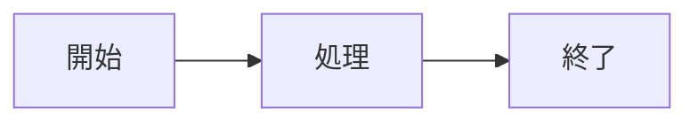

### 10.1 Flowchart

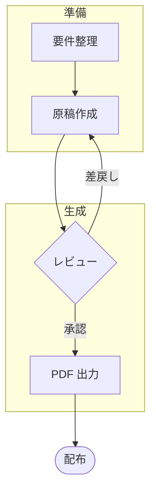

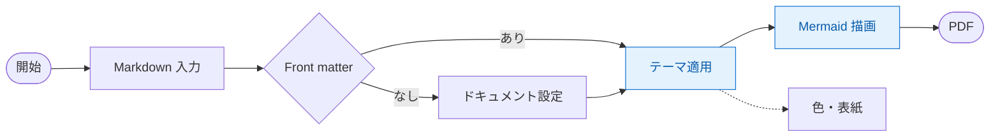

### 10.2 Sequence

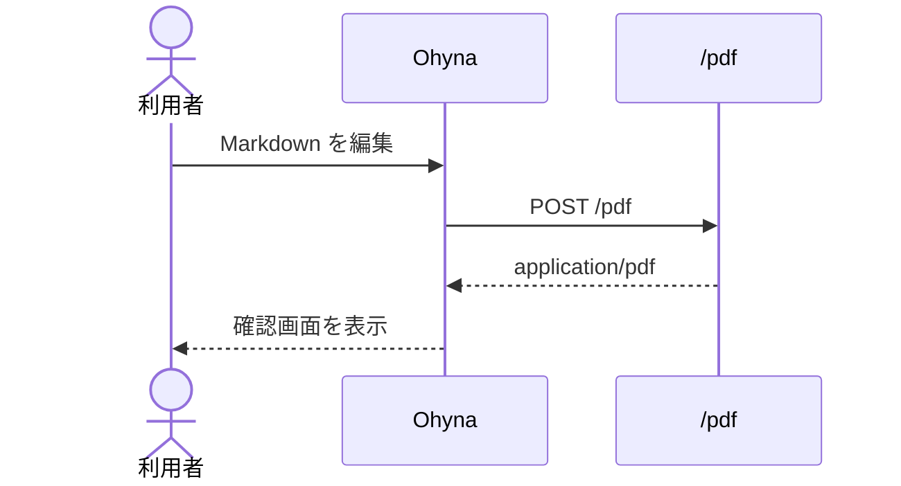

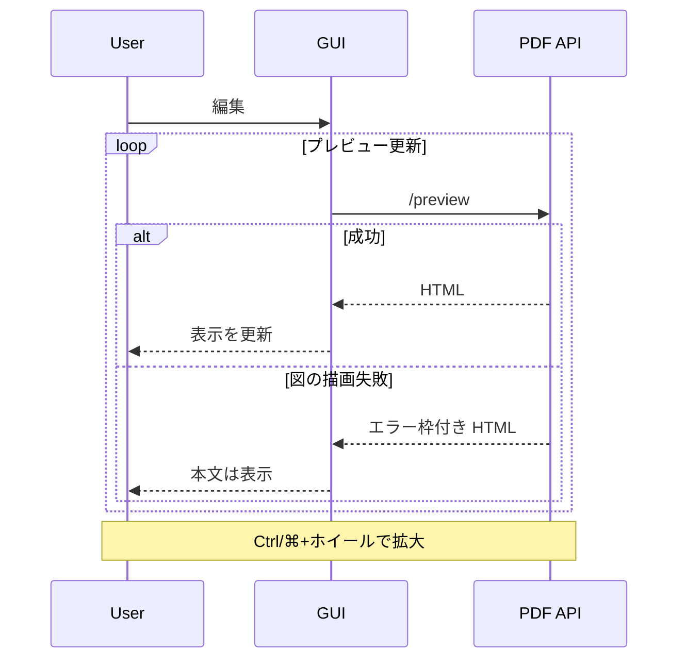

### 10.3 Class / State / ER

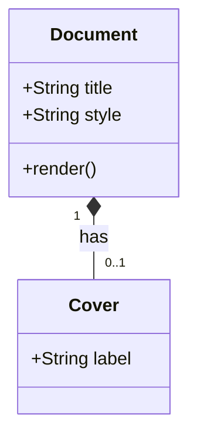

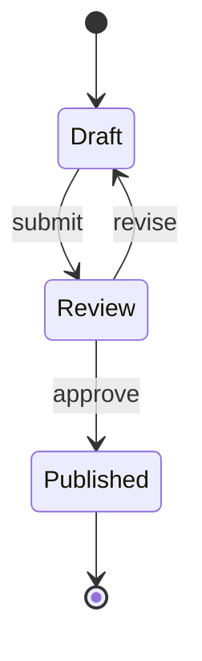

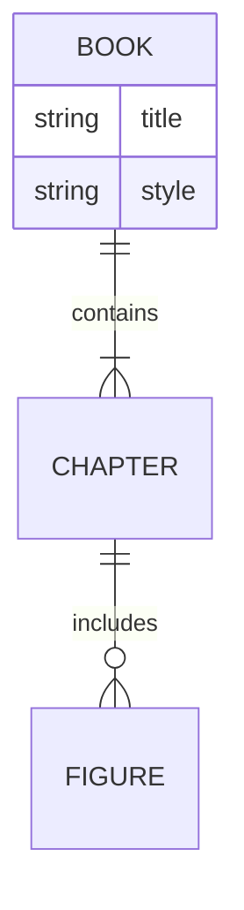

### 10.4 Gantt / Pie / Journey

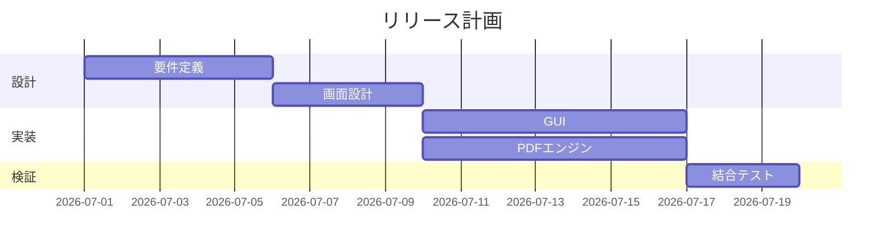

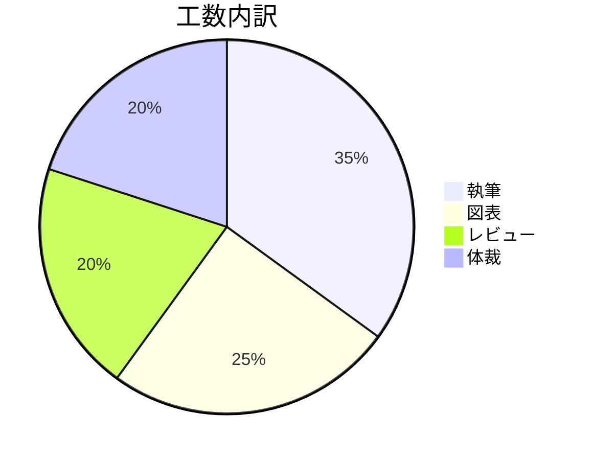

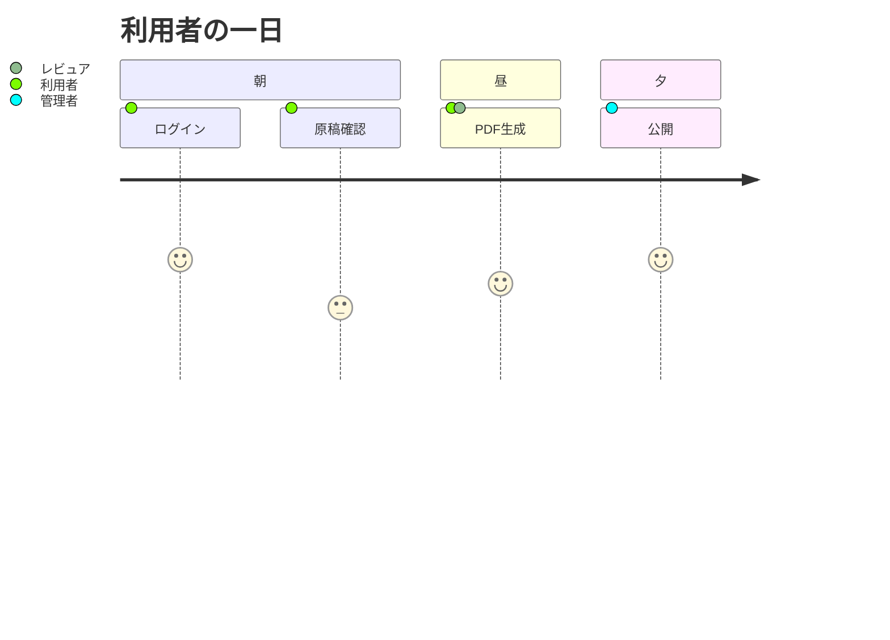

### 10.5 Git / Mindmap / Timeline / Quadrant

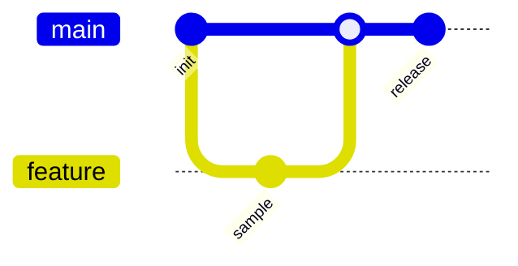

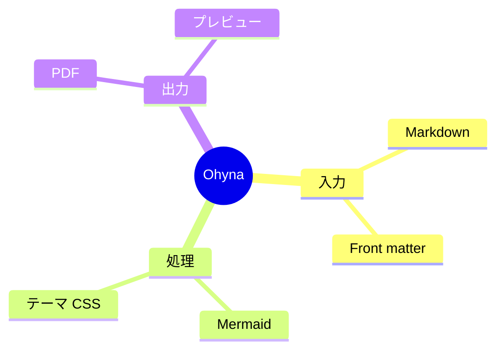

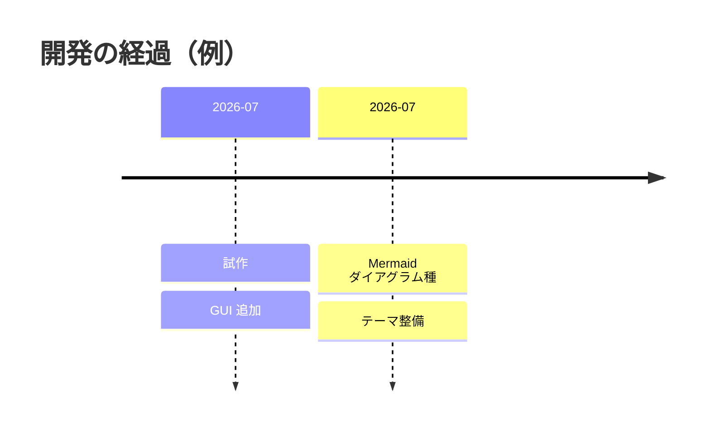

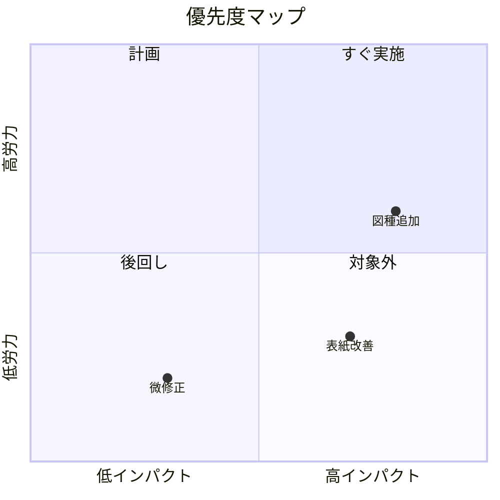

### 10.6 Sankey / XY / Kanban / Block

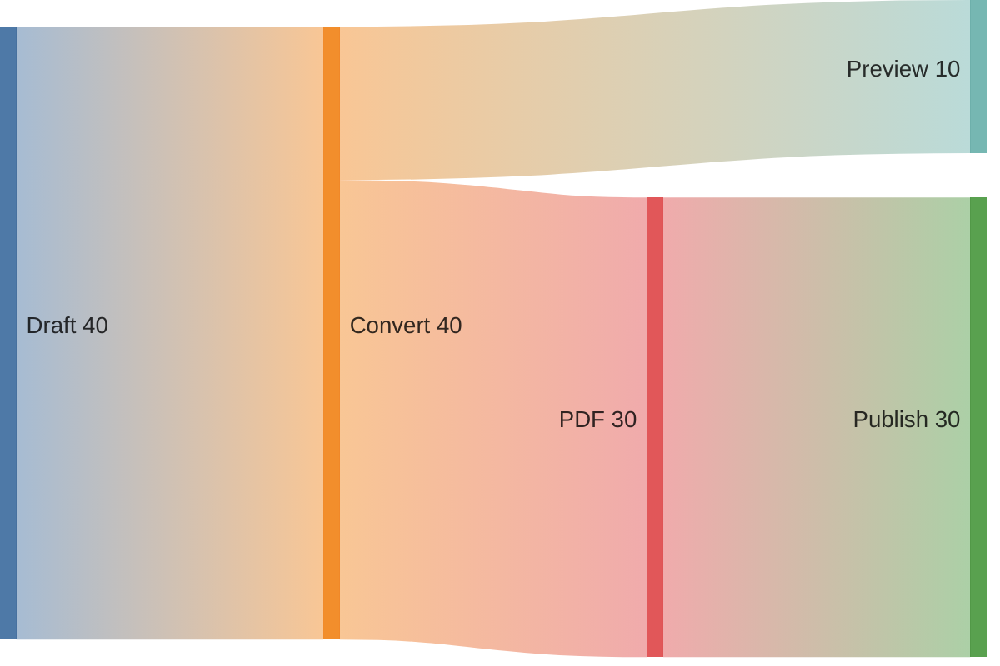

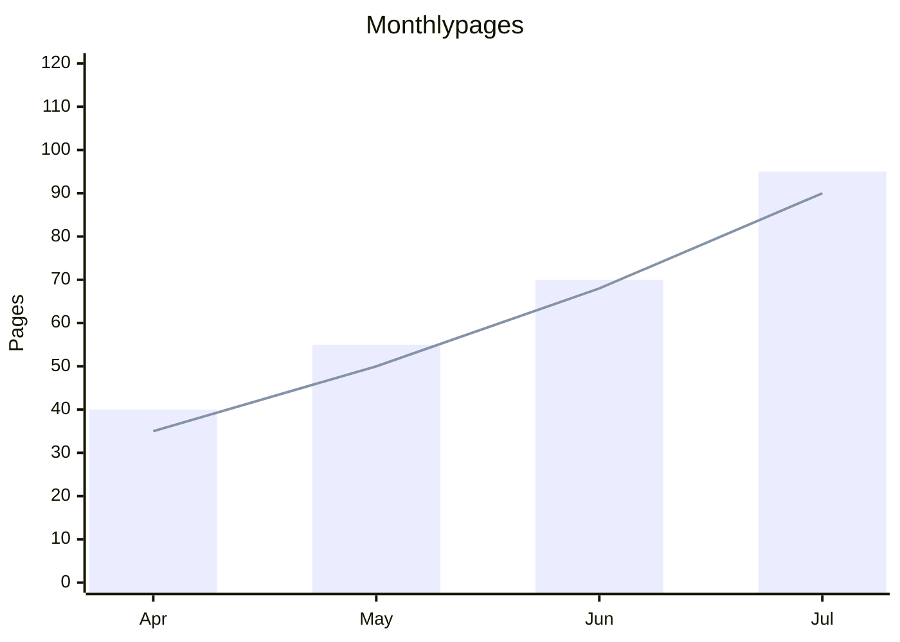

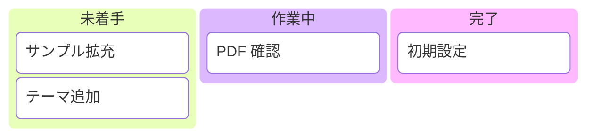

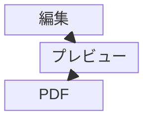

### 10.7 C4 / Architecture / Requirement / Packet / Radar / ZenUML

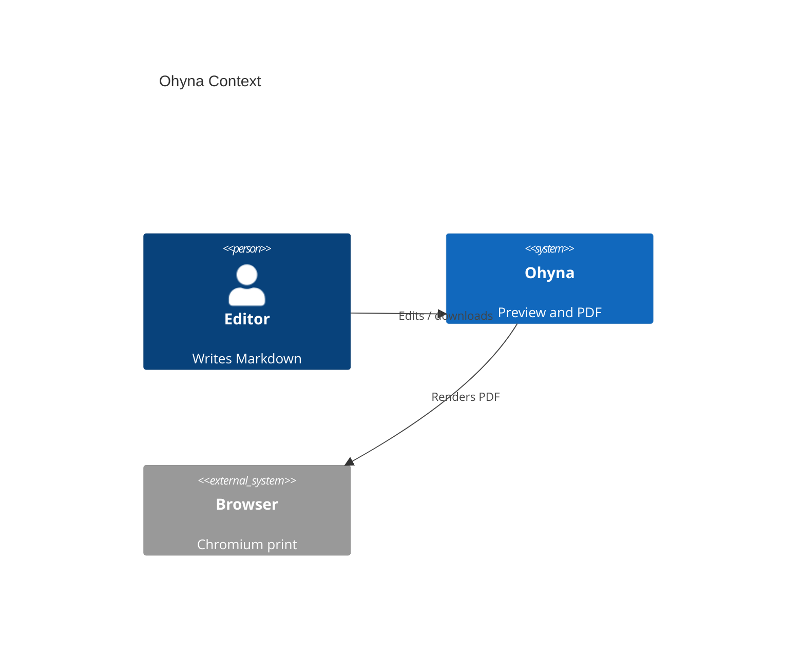

```mermaid
architecture-beta
  group api(cloud)[API]
  service gui(server)[GUI] in api
  service pdf(server)[PDF] in api
  service db(database)[Cache] in api
  gui:R --> L:pdf
  pdf:B --> T:db
```

```mermaid
requirementDiagram
  requirement pdf_output {
    id: "R-1"
    text: "Export A4 PDF from Markdown"
    risk: medium
    verifymethod: test
  }
  element gui {
    type: "web app"
  }
  gui - satisfies -> pdf_output
```

```mermaid
packet-beta
  title UDP Packet
  0-15: "Source Port"
  16-31: "Destination Port"
  32-47: "Length"
  48-63: "Checksum"
  64-95: "Data"
```

```mermaid
radar-beta
  title Quality
  axis a["Readability"], b["Coverage"], c["Speed"], d["Theme"]
  curve m["本製品"]{4, 5, 3, 4}
  max 5
  min 0
```

```mermaid
zenuml
  title Preview flow
  User->GUI: edit markdown
  GUI->API: POST /pdf
  API->GUI: PDF bytes
  GUI->User: show preview
```

### 10.8 Mermaid ソースのコード掲載

図ではなくソースとして示す場合の例です。

```text
flowchart LR
  A[開始] --> B[終了]
```

---

## 11. 確認項目

画面プレビューと PDF 確認の両方で見てください。

1. 第 0 章の準拠・製品契約の説明が読み取れること（完全 CommonMark／GFM 準拠を主張していないこと）。
2. 目次が独立したページになり、続きがあるとき「目次（続き）」と出ること。
3. 見出しから脚注までの本文要素が意図どおり表示されること。
4. 表、タスク、定義リストが読み取れること。
5. 各言語のコードブロックにシンタックスハイライトが付くこと。
6. `` ```mermaid `` が図、`` ```mermaid code `` がコード色分けになること。
7. 数式（インライン、ディスプレイ、フェンス）が描画されること。
8. Mermaid の各図種が描画されること。
9. キーボードキー（`<kbd>`）および表紙・色テーマがドキュメント設定どおりであること。
10. プレビュー上のリンクを押してもページ遷移しないこと。
11. 画面プレビューのページ割は近似であり、最終確認は PDF であること。
12. PDF 確認画面から「PDFを保存」「印刷」できること。
